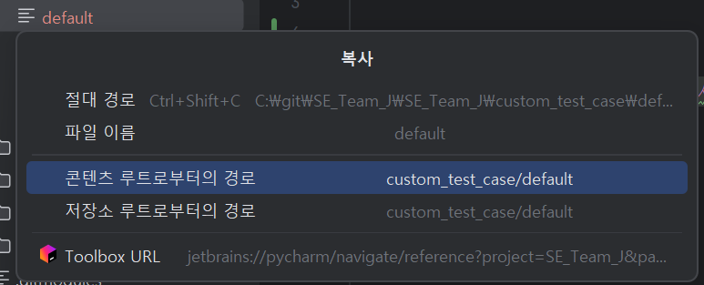
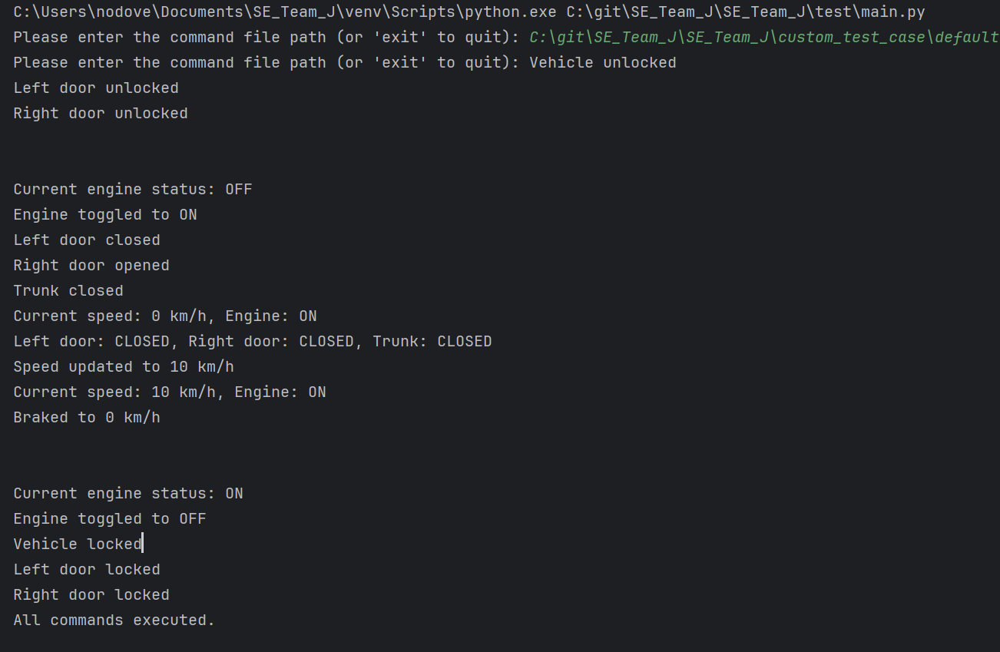
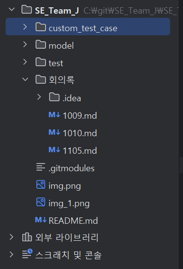

## 소프트웨어 공학 팀 프로젝트 J조
  11-05 교수님 참고 레포지토리 <model @ 38ddab5> 추가

### 테스트 케이스 [절대 경로]로 복붙해서 실행!!

##### 실행 예시 결과 이미지

## test 폴더에 있는 testcase 실행 안 됨!!

> 정의 요구사항이랑 맞지 않는 파일임!
> custom_test_case 에 있는 파일로 테스트 해보기!!